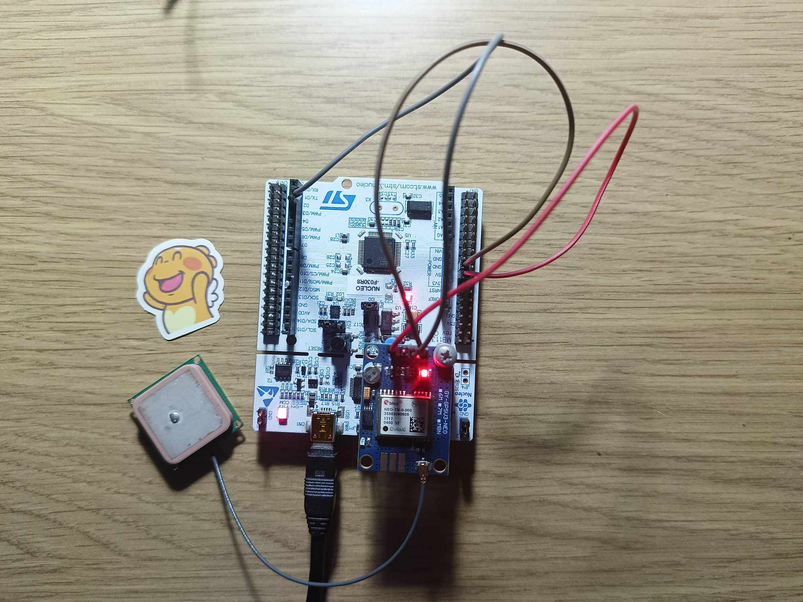

# STM32-u-blox-7C GNSS Integration over DMA 

## Overview

This repository contains code and resources for integrating the u-blox 7C GNSS module with the STM32 microcontroller.
This project aims to provide a reliable and efficient way to communicate with and use u-blox 7C GNSS data in STM32-based embedded systems.

## Features

**DMA UART Communication:** Utilizes DMA for efficient UART communication between STM32 and u-blox 7C module.

GPS Data Integration: Easily interface with the u-blox 7C GPS module to acquire location, date, time, and more.

Example Applications: Sample applications and code for common GNSS use cases.

Compatibility: Designed for STM32 microcontrollers, making it easy to integrate into your projects.

Configurability: Customize the library for your specific project requirements.

## Connections

this example built with **NUCELO F030R8** 

|u-blox 7C | Stm32f03 |
| ------ | ------ |
| TX | UART1_RX |
| 5V | 5V |
| GND | GND |

## Contributing
We welcome contributions from the community! Whether it's bug reports, feature requests, or code contributions, please feel free to open an issue or submit a pull request. Check out our Contribution Guidelines for more details.

## License

Creative Commons Zero v1.0 Universal

## Contact
If you have questions or need help, you can open an issue.
For other inquiries, feel free to reach out to contact@bousselmi.tn
